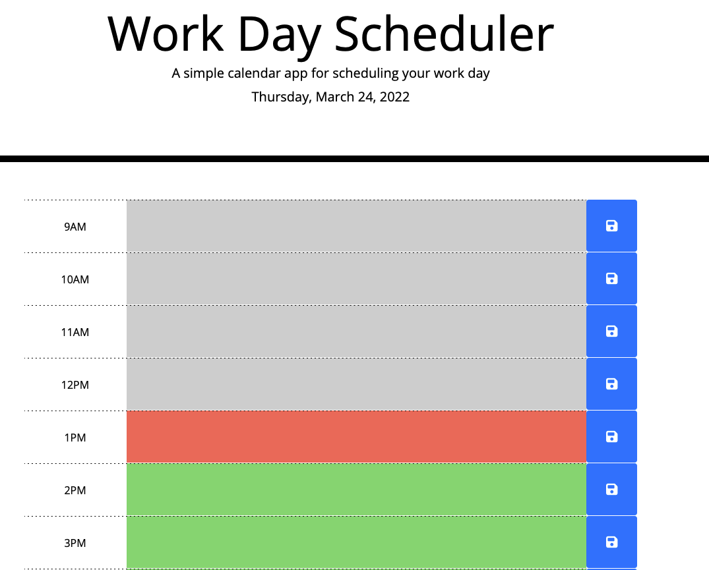

# Workday Planner

## Description

Simple application that allows users to create a schedule or plan for their workday.

## Features

- Daily planner alows user to create a schedule.
- Displays current time.
- Time blocks change color depending on the time of day.
- Can add plans to each time block.
- Saved plans will persist to local storage
- Can clear out all the plans.

## Usage

Try it out [here](https://mcarson24.github.io/workday_planner/).

## License

This project is open-sourced software and is licensed under the terms of the [MIT License](https://opensource.org/licenses/MIT).

